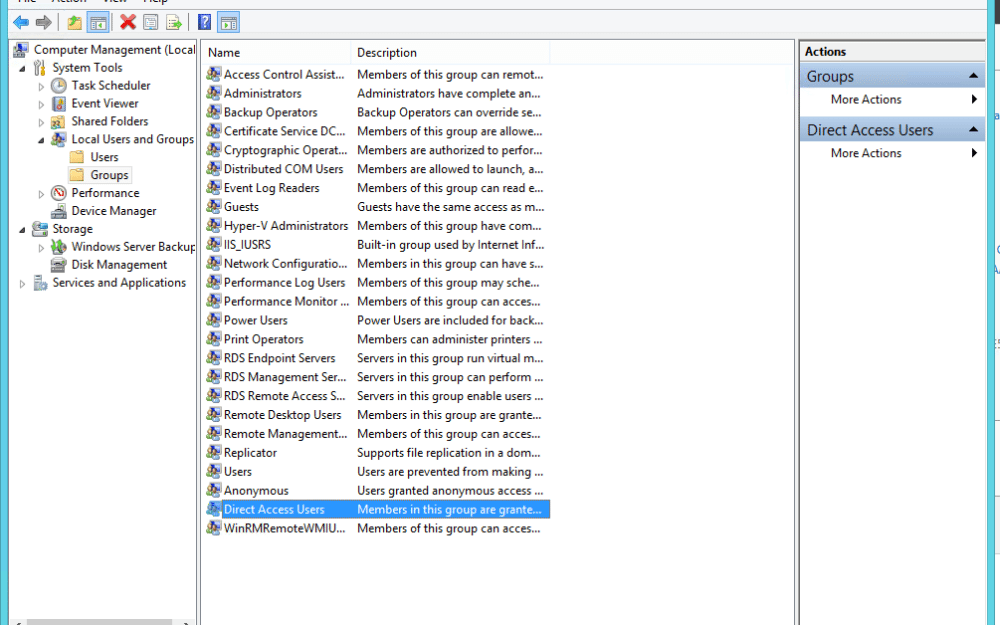
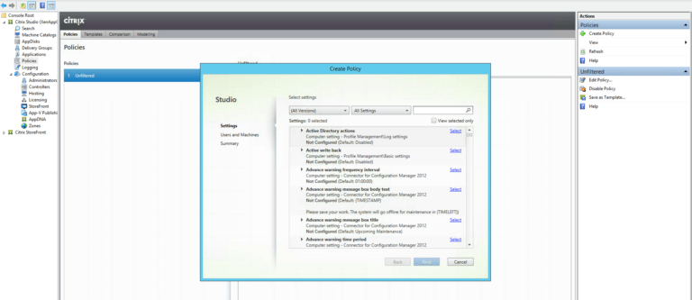
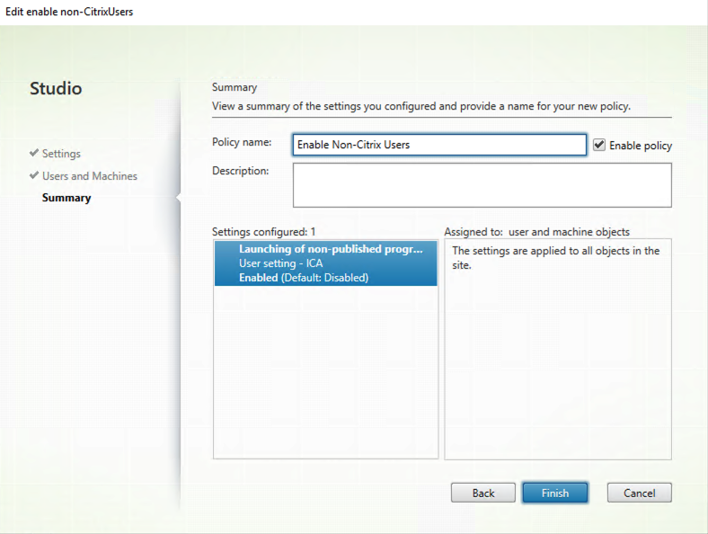
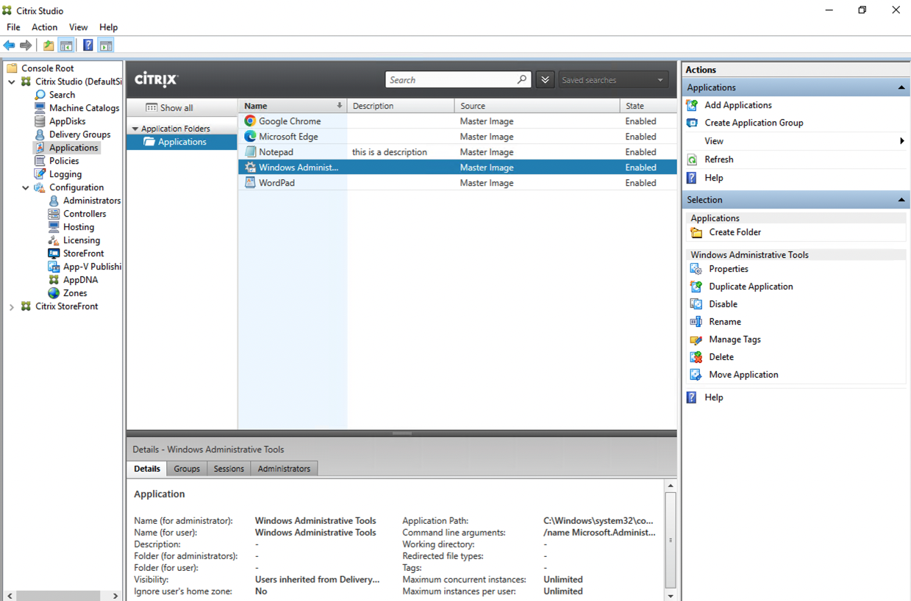
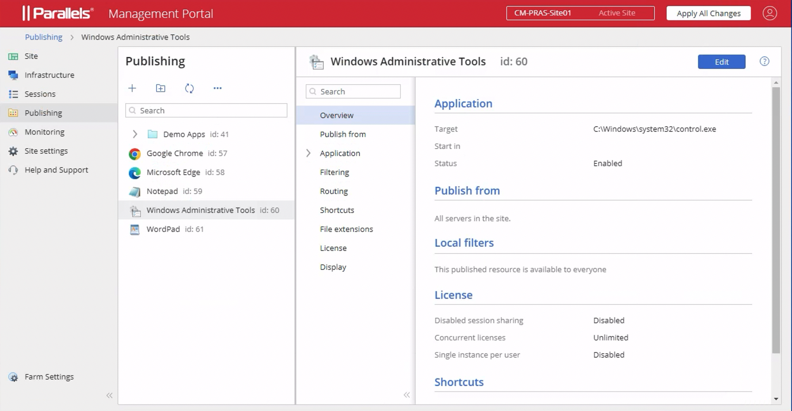

# Migration Summary

The Parallels RAS Migration tool operates in two key parts.

The first is to export the configuration from the existing Citrix
solution into a format that can be used in Parallels RAS.

The second is to import into an existing Parallels RAS environment.

The Application settings migrated include:

-   Display Name

-   Application Path

-   Description

-   Working Directory

-   Start Menu Folder

-   Command Line Executable

-   Application Type

-   Application Icon

The full process for using the migration tool is summarized below:

These steps are described further within this document.

# Prerequisites

Parallels® RAS Citrix Migration Tool Download


**Citrix Virtual Apps and Desktops version & components**

Citrix Virtual Apps and Desktops (CVAD) 1912 CU6 and above.

CVAD PowerShell cmdlets

Microsoft PowerShell v5.1

**Parallels RAS version & components**

Parallels RAS 19 and above

Parallels RAS PowerShell 19 or newer

Microsoft .Net Framework 4.5

Microsoft PowerShell v5.1

# Migration Steps

## Export Citrix Configuration

The first part of the migration process creates an XML settings file of
the applications configured within the Citrix Farm and converts the
Citrix settings to the equivalent Parallels RAS settings.

The process makes use of the Citrix CVAD PowerShell cmdlets. The cmdlets
are installed when Citrix Studio is installed and can also be installed
directly from the installation media.

Run the following PowerShell command from a host which has access to a
Citrix Delivery Controller to export these settings:

```powershell
.\CVAD7xExport.ps1 -ddc
[CitrixDeliveryControllerName] -folder [PathToOutputFolder]
```
Example as follows:

```powershell
.\CVAD7xExport.ps1 -ddc CTXDDC-01 -folder c:\temp\citrixexport
```

If the '-ddc' parameter is not specified, the script will assume it is
being run from a delivery controller and attempt to connect to the local
host.

The file applications.xml is saved to the folder path specified

## Install Parallels RAS Components

If you are installing a new Parallels RAS environment, follow the
guidance below to install the management components.

To install the Parallels RAS components, always refer to the
documentation relevant for the version you are using

Create the required components using a supported Windows operating
system (check the admin guide for the version of Parallels RAS you are
using here: <https://www.parallels.com/products/ras/resources/>).

Download the Parallels RAS installer from
https://www.parallels.com/products/ras/download/links/

Deploy Parallels RAS components following the installer steps.

Configure the Parallels RAS farm and activate it using your license key
(a trial can also be used).

### Installing Parallels RAS Agents

If you are deploying the Parallels RAS Agents to existing VMs (either
the current Citrix VDAs for testing, or new hosts based on the same
template image currently in use by the VDAs), you can follow the simple
wizard-driven process described in the Parallels RAS Admin guide, found
here: <https://www.parallels.com/uk/products/ras/resources/>. Look for
"Add an RD Session Host." Parallels RAS installs all the required agents
and settings for you.

Part of the wizard-driven process allows you to assign hosts to Groups.
It is recommended that a specific group is added for the imported hosts.
This group can be selected once the applications have been imported to
ensure the correct applications re-launched on the appropriate host.

As soon as the Parallels RAS Agents are installed on the target hosts
and their status is verified, the hosts are ready to accept connections.

## Import the Migrated Configuration into Parallels RAS

Place the applications.xml file into the folder you placed the Citrix
Migration Tool files.

Launch PowerShell and change -xmlpath the current path to the Parallels
RAS Citrix Migration Tool folder.

In the PowerShell console window, execute PrepareImport.ps1 script as shown
below:\

```powershell
.\PrepareImport.ps1 -XmlPathApplications .\applications.xml
```

Running this script will generate a ImportToRAS.ps1 script along
with the application icons in an icons folder. ImportToRAS.ps1 can
be then modified to your needs if required. If the script is going be
executed on a different host, the icons folder must be available too.

From a host which has the Parallels RAS PowerShell Module installed,
Place both the  ImportToRAS.ps1 script and the icons folder in the
same location and run the script as shown
below:\

```powershell
.\ImportToRAS.ps1
```
Provide your Parallels RAS server
hostname or IP address and administrator credentials when prompted.

Minimum supported Parallels RAS version is 19.x.

## Reconfigure any Remaining Settings

For this version of the Migration tool, only application settings are
imported into Parallels RAS. Features such as Zones and Server
configuration are not configured. The published applications are placed
within the Default Site within Parallels RAS and will be useable
following import, providing the applications are present on the VM in
the same folder structure.

It is advisable to use a Group to collate hosts of the same build
together. This Group can be selected in the "Publish From" tab of the
Published Application.

### Allow Access to Existing Citrix VDAs (Optional test)

For a migration, we recommend that Parallels RAS is installed on freshly
built operating system. However, if you wish to test the Parallels RAS
agents in a non-production environment on to existing Citrix VDAs, some
extra steps are needed to allow access these hosts, as Citrix restricts
access to connections made by their broker by default.

1.  **Add non-admin users to the "Direct Access Users" group**

> When the Citrix Virtual Delivery Agent is installed on a machine,
> non-administrators can no longer remotely connect directly to the host
> without using the Citrix broker. A new local group called Direct
> Access Users is created on each Virtual Delivery Agent. Add your
> non-administrator users to this local group, so they can connect
> directly to the machine.
>
> 


1.  **Enable non-published applications to be launched**

> By default, Citrix limits the launching of applications to those
> initiated by the Citrix Broker. A Group Policy setting can be changed
> to alter this. This can be set from Citrix Studio itself.
>
> Open Citrix Studio and navigate to **Policies**. On the top right,
> select **Create Policy**.
>
> 
>
> In the Search field at the top, enter **Launching of non-published
> programs during client connection** and select this policy.
>
> Chose **Enabled**
>
> 
>
> Name the Policy and select **Enable Policy**
>
> 
>
> Ensure the Policy takes precedence by selecting **Higher Policy** on
> the right-hand side.
>
> Then either wait until Group Policy updates, or force the Policy to
> update by running *gpudate /force.*

## Test Migration

As soon as the Parallels RAS Agents are installed on the target hosts
and their status is verified, the servers are ready to host RDP
connections.

Using Parallels Client, connect to the Parallels RAS Secure Gateway and
open one of the migrated applications to test.

Providing the applications are present on the host in the same folder
structure as there were in the CVAD configuration, the Published
Applications should now launch within Parallels RAS.

### Citrix Studio Console before Migration



### Parallels RAS Management Portal after Migration



## Uninstalling Citrix Components

In general, Uninstalling Citrix Components should be caried out via the
Windows feature to Remove Programs within the operating system. For more
information Citrix documentation should be referenced. At the time of
writing this documentation can be found here:
<https://docs.citrix.com/en-us/citrix-virtual-apps-desktops/install-configure/remove.html>

# Migration Components Summary

## Migrated Components

Application settings migrated include:

-   Display Name

-   Application Path

-   Description

-   Working Directory

-   Start Menu Folder

-   Command Line Executable

-   Application Type

-   Application Icon

## Components to be considered for migration in future versions of the migration tool
```
+-----------------------------------------------------------------------+
| Applications:\                                                        |
| • Create Shortcut on Desktop                                          |
|                                                                       |
| • Create Shortcut in Start Folder                                     |
|                                                                       |
| Application User limits                                               |
|                                                                       |
| File Type Association                                                 |
+-----------------------------------------------------------------------+
| Zones                                                                 |
+-----------------------------------------------------------------------+
| Servers                                                               |
+-----------------------------------------------------------------------+
| Delivery Groups                                                       |
+-----------------------------------------------------------------------+
| Machine Catalogs                                                      |
+-----------------------------------------------------------------------+
| Load Balancing Policies                                               |
+-----------------------------------------------------------------------+
| Load Evaluators                                                       |
+-----------------------------------------------------------------------+
| Policies                                                              |
+-----------------------------------------------------------------------+
```

## Powershell scrits that are required  by PrepareImport.ps1

-   RASMigrationEngine.ps1 - This is the engine that drive the conversion of the exported XML to ImportToRAS.ps1
-   Utilities.ps1 - This is a utility script which contains all the OU/AD resolution functions, Table creation, and Logs. 
