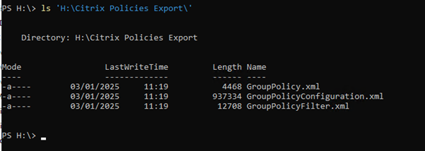
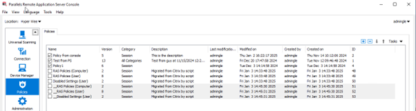

Parallels Remote Application Server: Migration Tool for Citrix Virtual Apps and Desktops and Citrix DaaS

V1.2

10th April 2025

Parallels International GmbH

Vordergasse 59

8200 Schaffhausen

Switzerland

Tel: + 41 52 672 20 30

www.parallels.com

© 2023 Parallels International GmbH. All rights reserved. Parallels and the Parallels logo are trademarks or registered trademarks of Parallels International GmbH in Canada, the U.S., and/or elsewhere.

Apple, Safari, iPad, iPhone, Mac, macOS, iPadOS are trademarks of Apple Inc. Google, Chrome, Chrome OS, and Chromebook are trademarks of Google LLC.

All other company, product and service names, logos, brands and any registered or unregistered trademarks mentioned are used for identification purposes only and remain the exclusive property of their respective owners. Use of any brands, names, logos or any other information, imagery or materials pertaining to a third party does not imply endorsement. We disclaim any proprietary interest in such third-party information, imagery, materials, marks, and names of others. For all notices and information about patents please visit https://www.parallels.com/about/legal/

## Version Control

|  |  |  |  |
| --- | --- | --- | --- |
| **Version** | **Date** | **Summary of Change** | **Editor** |
| 1.0 | 16th October 2024 | Initial Release | Chris Marks |
| 1.1 | 28th March 2025 | Updated to include User Filters on apps and Policy Migration (Appendix 2) | Chris Marks |
| 1.2 | 10th April 2025 | Updated to include Local App publishing (Citrix Published content) migration | Chris Marks |

[Parallels RAS](#parallels-ras)

[Migration Summary](#migration-summary)

[Prerequisites](#prerequisites)

[Migration Steps](#migration-steps)

[Export Citrix configuration](#export-citrix-configuration)

[Install Parallels RAS components](#install-parallels-ras-components)

[Installing Parallels RAS Agents](#installing-parallels-ras-agents)

[Import the migrated configuration into Parallels RAS](#import-the-migrated-configuration-into-parallels-ras)

[Reconfigure any remaining settings](#reconfigure-any-remaining-settings)

[Allow access to existing Citrix VDAs (optional test)](#allow-access-to-existing-citrix-vdas-optional-test)

[Test migration](#test-migration)

[Citrix Studio console before migration](#citrix-studio-console-before-migration)

[Parallels RAS Management Portal after migration](#parallels-ras-management-portal-after-migration)

[Uninstalling Citrix components](#uninstalling-citrix-components)

[Migration Components Summary](#migration-components-summary)

[Migrated components](#migrated-components)

[PowerShell scripts that are required by the Migration Tool](#powershell-scripts-that-are-required-by-the-migration-tool)

[Components considered for migration in the future versions of RAS Migration Tool](#components-considered-for-migration-in-the-future-versions-of-ras-migration-tool)

[Appendix 1: Policy Migration (Experimental)](#appendix1-install-of-parallels-ras)

[Exporting from Citrix](#exporting-from-citrix)

[Importing to RAS](#importing-to-ras)

# Parallels RAS

Parallels Remote Application Server (RAS) provides vendor independent virtual desktop and application delivery from a single platform. Accessible from anywhere with platform-specific clients and web enabled solutions, like the built-in Parallels Web Client, Parallels RAS allows you to publish remote desktops, applications, and documents, improving desktop manageability, security, and performance.

Parallels RAS extends Windows Remote Desktop Services by using a customized shell and virtual channel extensions. Parallels RAS supports all major hypervisors from Microsoft, VMware, and other vendors, including Hyperconverged solutions such as Nutanix and Scale Computing, and Cloud platforms and services such as Microsoft Azure, Azure Virtual Desktop, and Amazon Web Services, enabling the publishing of virtual desktops and applications to Parallels Client. The product includes powerful universal printing and scanning functionality, as well as resource-based load balancing and management features. With Parallels Device Manager feature for Parallels RAS you can also centrally manage user connections and PCs converted into thin clients using the free Parallels Client.

# Migration Summary

Parallels RAS Migration Tool for Citrix Virtual Apps and Desktops (also referred to as RAS Migration Tool in this document) operates in two key steps.

The first is to export the configuration from the existing Citrix solution into a format that can be used in Parallels RAS.

The second is to import it into an existing Parallels RAS environment.

The application settings migrated include:

* Display Name
* Application Path
* Description
* Working Directory
* Start Menu Folder
* Command Line Executable
* Application Type
* Application Icon
* Application User/Group Filtering rules\*

Citrix Published content delivering a URL to be launched locally is also migrated and shows up in Parallels RAS as a Published Local Application.

\* - Both Citrix CVAD/DaaS and RAS have multiple methods of filtering. Currently, User/Group filtering is migrated as this is the most prevalent method. Additional Filtering rule migration inclusions may be included in future versions of the tool

To obtain the scripts needs to complete the migration from Citrix CVAD/DaaS to Parallels RAS, please navigate. To the Parallels GitHub repository here: <https://link.parallels.cn/bU3Ou5>

It is also possible to migrate a number of policy settings from Citrix to RAS too. For more information on this process, please refer to Appendix2 at the end of this document

.

# Prerequisites

**Parallels RAS** Migration Tool for Citrix Virtual Apps and Desktops and DaaS is available for the community to use from GitHub [here](https://github.com/Parallels/RAS-PowerShell/tree/master/Tools/Migration%20Tool%20for%20Citrix%20Virtual%20Apps%20and%20Desktops).

**Citrix versions & components**

* Citrix Virtual Apps and Desktops (CVAD) 1912 CU6 or later or Citrix DaaS
* CVAD PowerShell cmdlets
* Microsoft PowerShell v5.1

**Parallels RAS versions & components**

* Parallels RAS 19 or later
* Parallels RAS PowerShell 19 or later
* Microsoft .Net Framework 4.5
* Microsoft PowerShell v5.1

# Migration Steps

## Export Citrix configuration

The first part of the migration process creates an XML settings file of the applications configured within the Citrix Farm and converts the Citrix settings to the equivalent Parallels RAS settings.

The process makes use of the Citrix PowerShell cmdlets. The cmdlets are installed when Citrix Studio is installed and can also be installed directly from the installation media.

1. Run the following PowerShell from a host that has access to a Citrix Delivery Controller to export these settings:

   .\CVAD7xExport.ps1 -ddc [CitrixDeliveryControllerName] -folder [PathToOutputFolder]
2. Example:
   .\CVAD7xExport.ps1 -ddc CTXDDC-01 -folder c:\temp\citrixexport

   If the ‘-ddc’ parameter is not specified, the script will assume it is being run from a delivery controller and attempt to connect to the local host.
3. The file applications.xml is saved to the folder at the specified path.

## Import the migrated configuration into Parallels RAS

1. Ensure you have installed Parallels RAS ready to receive the migrated applications. For help with this, please see the admin guide here: or the summary at the end of this document
2. Place the applications.xml file into the folder where you placed the RAS Migration Tool files.
3. Launch PowerShell and navigate to the folder containing the RAS Migration Tool.
4. In the PowerShell console window, execute PrepareImport.ps1 script as shown below:

   .\PrepareImport.ps1 -XmlPathApplications .\applications.xml

   Running this script will generate an ImportToRas.ps1 script along with the application icons in an icons folder. ImportToRas.ps1 can be then modified to your needs if required. If the script is going be executed on a different host, the icons folder must be available there too.
5. From a host that has the Parallels RAS PowerShell component installed, place both the ImportToRas.ps1 script and the icons folder in the same location and run the script as below:

   .\ImportToRas.ps1
6. Provide your Parallels RAS server (the Primary Connection Broker) hostname or IP address and administrator credentials when prompted.

### **Migration is now complete**

### Test migration

As soon as the Parallels RAS Agents are installed on the target hosts and their status is verified, the servers are ready to host RDP connections. The agent state can be verified within the Parallels RAS management console, where the host will have a Status of “OK.”

Using Parallels Client, connect to the Parallels RAS Secure Gateway and open one of the migrated applications to test.

Providing the applications are present on the host in the same folder structure as there were in the CVAD configuration, the published applications should now launch within Parallels RAS.

## Optional Steps following migration

### Reconfigure any remaining settings

For this version of RAS Migration Tool, only application settings are imported into Parallels RAS. Features such as Zones and Server configuration are not configured. The published applications are placed in the Default Site within Parallels RAS and will be useable following import, providing the applications are present on the VM in the same folder structure.

It is advisable to use a group to collate hosts of the same build together. This group can be selected by going to the Publishing category, selecting a published application, and switching to the “Publish From” tab.

### Allow access to existing Citrix VDAs (optional test)

For a migration, we recommend that Parallels RAS is installed on freshly built operating system. However, if you wish to test the Parallels RAS Agents in a non-production environment with hosts which are already acting as Citrix VDAs, some extra steps are needed to allow access to these hosts as Citrix restricts access to connections made by their broker by default.

1. **Add non-admin users to the “Direct Access Users” group**

When the Citrix VDA is installed on a machine, non-administrators can no longer remotely connect directly to the host without using the Citrix HDX Broker. A new local group called Direct Access Users is created on each VDA. Add your non-administrator users to this local group so they can connect directly to the machine.

1. **Enable non-published applications to be launched**

By default, Citrix limits the launching of applications to those initiated by the Citrix HDX Broker. A Group Policy setting can be changed to alter this. This can be set from Citrix Studio itself.

Open Citrix Studio and navigate to **Policies**. On the top right, select **Create Policy**.

> 

In the Search field at the top, enter Launching of non-published programs during client connection and select this policy.

Chose Enabled.

> 

Name the Policy and select **Enable Policy.**

> 

Ensure the Policy takes precedence by selecting **Higher Policy** on the right-hand side.

Then either wait until Group Policy updates or force the Policy to update by running *gpudate /force.*

### Citrix Studio console before migration

> 

### Parallels RAS Management Portal after migration

> 

### Uninstalling Citrix components

In general, uninstalling Citrix components should be carried out via the standard Windows tools. For more information Citrix documentation should be referenced. At the time of writing this documentation can be found here: <https://docs.citrix.com/en-us/citrix-virtual-apps-desktops/install-configure/remove.html>.

# Migration Components Summary

## Migrated components

Application settings migrated include:

* Display Name
* Application Path
* Description
* Working Directory
* Start Menu Folder
* Command Line Executable
* Application Type
* Application Icon
* Application User/Group Filtering rules

## PowerShell scripts that are required by the Migration Tool

|  |  |
| --- | --- |
| **CVAD7xExport.ps1:** | This exports the configuration from the Citrix Virtual Apps and Desktops environment into XML format. |
| **PrepareImport.ps1:** | This is the startup script for the import, and uses the xml produced by CVAD7xExport.ps1. |
| **RASMigrationEngine.ps1:** | This is the engine that drives the conversion of the exported XML from PrepareImport.ps1 to ImportToRAS.ps1. |
| **Utilities.ps1:** | This is a utility script which contains all the OU/AD resolution functions, Table creation, and Logs. This is required by PrepareImport.ps1. |
| **ImportToRas.ps1** | This script is created by running PrepareImport.ps1 and is used for the final step of the process to import the configuration into Parallels RAS. |

## Components considered for migration in the future versions of RAS Migration Tool

|  |
| --- |
| Applications: • Create Shortcut on Desktop  • Create Shortcut in Start Folder   * Application User limits * File Type Association |
| Zones |
| Servers |
| Delivery Groups |
| Machine Catalogs |
| Load Balancing Policies |
| Load Evaluators |

## Appendix1: Install of Parallels RAS

### Install Parallels RAS components

If you are installing a new Parallels RAS environment, follow the guidance below to install the management components.

Note: To install the Parallels RAS components, always refer to the documentation relevant for the version you are using.

1. Create the required components using a supported Windows operating system (check the Administrator's Guide for the version of Parallels RAS you are using here: <https://www.parallels.com/products/ras/resources/>).
2. Download the Parallels RAS installer from <https://www.parallels.com/products/ras/download/links/>
3. Deploy Parallels RAS components following the installer steps.
4. Configure a Parallels RAS Farm and activate it using your license key (a trial can also be used).

### Installing Parallels RAS Agents

If you are deploying the Parallels RAS Agents to existing VMs (either the current Citrix Virtual Delivery Agents (VDAs) for testing, or new hosts based on the same template image currently in use by the VDAs), you can follow the simple wizard-driven process described in the Parallels RAS Administrator's Guide, found [here](https://www.parallels.com/products/ras/resources/) (open the administrator’s guide and look for “Add an RD Session Host.”). Parallels RAS installs all the required agents and settings for you.

Part of the wizard-driven process allows you to assign hosts to groups. You should create a specific group for the imported hosts. This group can be selected once the applications have been imported to ensure that the correct applications is re-launched on the appropriate host.

As soon as the Parallels RAS Agents are installed on the target hosts and their status is verified, the hosts are ready to accept connections.

## Appendix 2: Policy Migration (Experimental)

Independent of migrating applications from Citrix to Parallels RAS, it is also possible to migrate a number of matching policies too. It should be noted however that many items within Citrix Policies are specific to Citrix and are not needed by Parallels RAS. Also, some settings are dealt with by Citrix differently and do not appear in Policy (e.g. settings within Storefront). Equally, many policy items within Parallels RAS are unique to RAS and don’t have a Citrix equivalent, so you should carefully check which policy items you wish to migrate.

To access the scripts required to perform Policy Migration, go to the folder located here: <https://link.parallels.cn/vhnt8S>

NOTE: Parallels RAS uses only the highest priority policy and not a resultant policy for a group or a user appearing in multiple policies. It is strongly recommended that customers test policy import full to ensure functionality is as expected. Manipulation of the imported policies may be needed to match the configuration present in Citrix.

### Exporting from Citrix

To export Citrix policies from CVAD 7.x, a module is required which is available on Delivery Controllers. Launch a PowerShell prompt as a user who has permission to read Citrix policy objects and run the following:

Import-Module -Name "$env:ProgramFiles\Citrix\Telemetry Service\TelemetryModule\Citrix.GroupPolicy.Commands.psm1"

New-PSDrive -PSProvider CitrixGroupPolicy -Name LocalFarmGpo -Root \ -Controller $env:COMPUTERNAME

Export-CtxGroupPolicy -FolderPath "H:\Citrix Policies Export"

> 

The folder passed to the -folderPath parameter will be created if it does not exist and will be populated with three files

> 

Note that the files produced are CLI XML format and as such should be ingested by PowerShell using Import-CliXML as opposed to treating them as XML.

The deprecation warning for New-PSDrive can be safely ignored – the replacement cmdlets have only recently gone live and a date for their removal, let alone their deprecation, has not yet been announced so it was decided to use the “legacy” approach in order to provide as much backward compatibility with older CVAD releases as possible. The script development and testing were performed with the 2406 and later the 2411 release.

### Importing to RAS

The PowerShell script that processes the policies exported from Citrix, referred to as the “generator script”, reads those files and outputs PowerShell that can be run on a Parallels RAS Connection Broker as it requires the RASAdmin PowerShell module. The generator script must also be run where the RASAdmin module is available and must be run in X64 (AMD64) PowerShell – it will not work with ARM64.

The generator script is called “Citrix Policy conversion to RAS.ps1” and should be invoked where C:\Parallels is the root folder where all GitHub assets for this have been placed. It does not need to be run as a user with access to the destination RAS farm:

Example: *'C:\Parallels\Citrix Policy conversion to RAS.ps1' -mappingFile "C:\Parallels\RAS Policy Mapping.csv" -citrixPolicyFolder "H:\Citrix Policies Export" > migration2RAS.ps1*

> 

This will produce a file called “migration2RAS.ps1” (referred to as the generated script) in the current working directory for the PowerShell session which can then be run as a user who has permission to create RAS policies where it will prompt interactively for the password for the account running the generated script.

> 

Warnings will be shown for elements that cannot be migrated to RAS, generally because RAS does not have an equivalent setting to that in Citrix.
In addition, a -prefix parameter can be used which will prefix all newly created policy names with the string that is passed to this parameter such as “\_\_”.

All policies will be created in the disabled state unless -enabled parameter is used which is not advised if the RAS deployment is in production with active users.

> 

If policies already exist with the same names when the generated script is run, it will error and abort. Either delete the clashing policies in the RAS console, having backed them up first, or use the -prefix parameter to the generator script to produce different policy names.

> 
